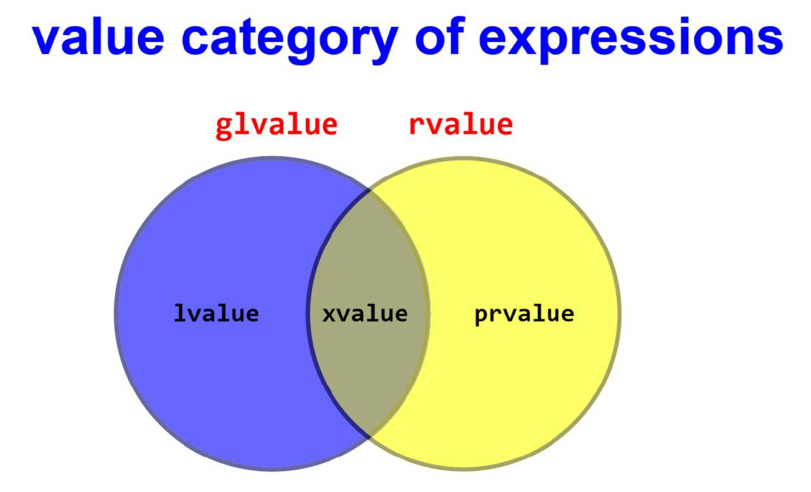
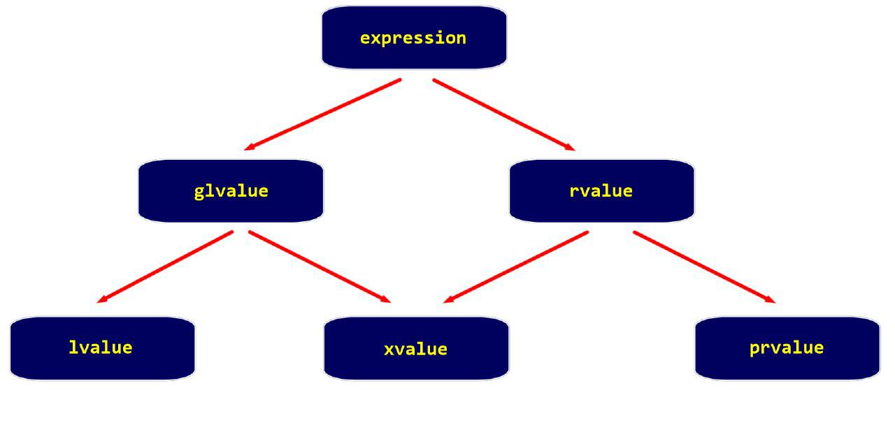
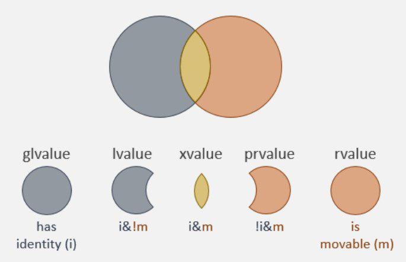

# Lecture 03 (10 September 2019)

## Initialization

```cpp
int x = 10; // copy init.
int y(30); // direct init.
int z{40}; // uniform init. yada list init.
```

- narrowing conversion
  - mesela double i int e cevirme

- most vexing parse
  - {} yerine () kullanilinca func bildirimi ile degisken bildirimi karisiyor
  - boyle durumlarda func oncelikli

- value init.
  - `int x{};`
  - int, double vs turlerde 0
  - bool ise false
  - ptr ise nullptr

- aggregate init
  - `int a[] = {3, 6, 4};`
  - `int a[]{3, 6, 4};`

- `int a[10]{};`
  - 10 elemanli 0 degerli init edilmis

- C deki array C++ da yaygin degil
- Eski kod degilse ve eski interface icin gerekmiyorsa kullanilmaz

- Valid ptr, invalid ptr, dangling ptr, null ptr (bunlar bilinmeli)
 
- C de `int *p = 0;` bir donusturme (casting) ile yapilmis oluyor
  - `int *p = NULL; // (void*) 0`

- C deki tarz type casting C++ da cok kullanilmiyor
- C++ in kendi casting yontemleri var
  - static_cast
  - const_cast
  - reinterpret_cast
  - dynamic_cast

- C++ da macro lar conditional compiling icin kullaniliyor

- Modern C++ da yeni bir null ptr keyword u var
  - `int *p = nullptr;`
  - `int p = nullptr;` bu ifade syntax hatasi olacak cunku nullptr_t type indan otomatik donusum yok
  - C deki NULL kullanildiginda yukaridaki ifade syntax hatasi olmayacakti, 0 ile init edilmis olacakti

## Reference semantics

- C deki ptr lar yerine cogu durumda C++ da reference kullaniliyor
- ptr larin object oriented hali denebilir
- low level deki implementation da ptr ile ayni sayilabilir
- Lvalue reference (sol taraf referansi eskiden gelen bir yapi)
- Rvalue reference (sag taraf refereansi ise C++11 de eklenmis)
  - `move semantics` ve `perfect forwarding` icin Rvalue gerekli
  - function overloading kisminda kullanilacak

- Klasik C de

```cpp
int x = 10;
int *ptr = &x;
int *const ptr = &x; // surekli x i gosterecek
```

- C++ da
  - bildirimdeki & adres degil atom declarator

```cpp
int &r = x; // r x'e bir reference
r = 50; // x'e atama oluyor
int *ptr = &r; // x'in adresi
```

- referans ilk deger vermeden tanimlanmaz (const gibi)
  - `int &r; // syntax hatasi`

- referanslar otomatik olarak const oluyorlar
- sonradan baska nesneye refereans edilemezler

- Lvalue referanslara ilk deger veren ifadeler de Lvalue olmali
  - `int &x = 10; // syntax hatasi`

- C++ da expression (ifade) ornekleri

```cpp
10
x
x+5
*ptr
p->x
a*a+b*b
```

- bir ifadenin turu (data type) ve value category si farkli seyler

- C de value categories
  - Lvalue expression
  - Rvalue expression

- C++11 e kadar durum ayniydi
- Modern C++ da (C++11 ve sonrasi)
  - Lvalue expression (Left value)(sol anlami yok olmus artik)
  - Xvalue expression (expiring value)
  - PRvalue expression (pure R value)




- isimlendirilmis nesneler herzaman Lvalue dur

```cpp
int x = 10;
int *ptr = &x;
int a[5]{0};
```

- sabitler ve operatorler PRvalue dur

```cpp
10;
x+10;
x*y;
x++;
x--;
```

- `--y; ++x;` ifadeleri C de Rvalue C++ da Lvalue dur

- `x > 10 ? x : y;` ifadesi C de Rvalue, C++ da ise `x:y` ifadesi Lvalue ise Lvalue dur

- C de `(x,y)` hicbir zaman Lvalue olmaz
- C++ da y Lvalue ise `(x,y)` ifadesi Lvalue dur

- `int func();` `func();` PRvalue dur
- `int &func();` `func();` Lvalue dur

- Sol taraf referansina sag taraf degeri verilemez
- Sag taraf referansina sol taraf degeri verilemez
- Lvalue reference ====> Lvalue expression olmali
- Rvalue reference ====> Rvalue expression olmali

```cpp
int &&r = 10; // bu gecerli

int x = 20;
int &&r = x; // bu syntax hatasi rvalue ref a lvalue atanamaz
```
