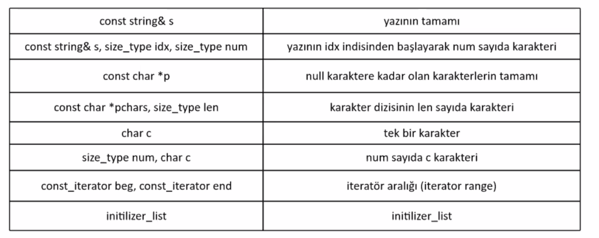

# Lecture 18 (05 November 2019)

# String Class
- C deki `char* char[]` lerde yazilari tutmayacagiz artik.
- C++ de string class lar kullaniliyor.
- STL deki bir container.
- Klasik bir container in ozelliklerini barindiriyor.

- vector ve string en cok kullanilan container lar.
ikisi de dynamic array class

## String derken neler kastediliyor olabilir
1. cstring
1. string literal "something"
1. elemanlari char olan const dizi
1. C de char dizi
1. C++ da const char dizi
- `char *p = "something"; // syntax hatasi`
cunku `const char *`  dan `char *` a donusum yok.
array to ptr conversion olmasi lazim.
donusturulecegi adres turu `const char *` olmali

- dynamic array containerlar genelde 3 ptr tutar
    1. allocate edilmis adres baslangici
    1. size
    1. capacity
    
- iki onemli ozelligi var
    1. bellekte tek yerde oldugu icin (contigues) index ile uyeye erisme maliyeti O(1) constant time
    1. sondan ekleme ve sondan silme islemleri de constant time (capacity yeterli ise)
    amortised constant time (reallocated gerektiginde ekstra maliyet var)

- eger `size` `capacity` e ulasirsa reallocation yapilacak.
ogeler yeni yere tasinacak, bunun ciddi maliyeti olabilir.
reallocation ihtimali goz onunde bulundurularak kod yazilmali.
- "reallocation takes time"
- reallocation oldugunda eger ptr ve referens kullaniyor idiysek dangling ptr olacak

- string aslinda bir sinif degil. 
bir sinif sablonundan elde edilen sinif (template)

- string bir type alias
`basic_string` template ismi
```cpp
basic_string<char, char_traits<char>, allocator<char>> str;
basic_string<char> str; // iki parametre default
string str; // type alias
```

- regex sinifi
- C++17 ile gelen string_view sinifi (bazi islemlerin verimini yukseltiyor)
- algorithm

<br> 

- reallocation da genelde 1,5 kat gibi birsey kullaniliyor. (implementasyona bagli)

- dynamic diziler cok optimizasyon edildiginden teorik olarak daha verimsiz olmasi gereken veri yapilarindan bile daha verimli olabilir.

- SSO (small string optimization)
    - string 3 ptr den baska ayrica da bir yer tutar (buffer)
    - eger buyurse dynamic memory kismina alir
    
- string nesnesi zamanla buyuyecekse ve ulasacagi maks uzunlugu biliyorsak bastan allocate edilmesini saglayabiliriz. Diger turlu defalarca reallocate yapiliyor.
    - reserve interface i var

- dynamic dizi otomatik buyutuluyor ama kucultme otomatik yapilmiyor.
- bunu da bizim yapmamiz lazim. fazla capacity i geri vermek lazim yani

<br>

- Note: sinif neslerinde non static data memberlar size of olarak hesaplanir.
uye func lar ve static member lar sizeof u etkilemez

<br>

- modern cpp ile string interface i baya degisti

- nicolay (alman yazar) in stl kitabi reference olabilir

- cppreference.com

- string in nested type lari
- `string::size_type`
- adres yerine index agirlikli olarak kullaniliyor. index in turu bu iste
- arama interfacelarinin donusu
- tane, adet turu interfacelarda kullaniliyor 

- `const string& s` (yazinin tamami)
- `const string& s, size_type idx, size_type num`
- `const char*` (adresini aldigi yazinin tamaminda islem yapacak null charactere kadar)
- `const char*, size_type len` (bu adresten bu uzunluk kadar)
- `char c` (tek karakter uzerinde islem)
- `size_type num, char c` (filling doldurma su kadar adet bu karakterden)


- size() ve length() in donus degeri string::size_type yada auto olmali

- empty() false true donuyor bos olup olmamaya gore

## string in ctor grubu


