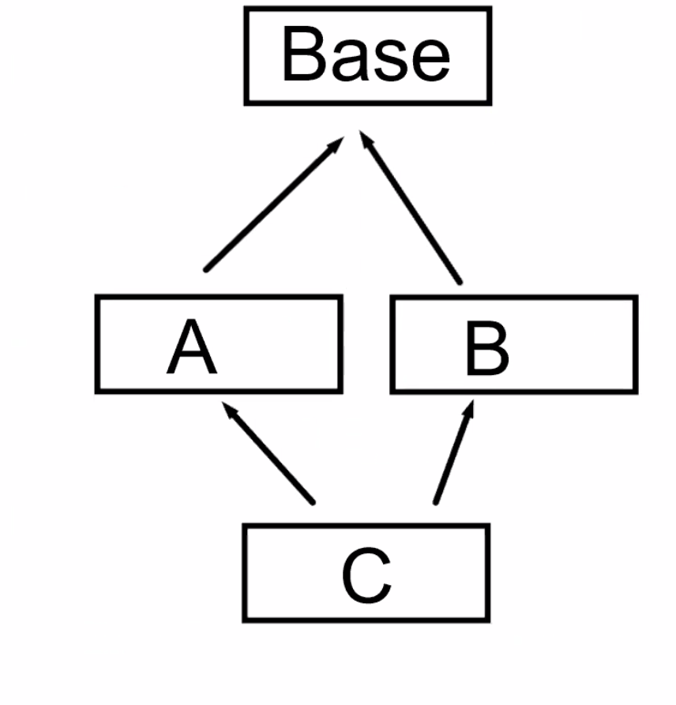

# Lecture 24 (26 November 2019)

# Inheritance cont.

- base class daki func sanal degilse onu public kalitimda yeniden tanimlamak iyi bir davranis degil.
    - base deki func i gizler
    - farkli cagrilarda farkli implementationlar cagrilir
    - bu olay farkli amac icin private ve protected da yapilabilir

## C++11 inherited ctor
- derived class sadece extend edilmek istendiginde, eger base de default ctor disinda ctor varsa onlar da dikkate alinmali
- derived class ta uygun ctor lar tanimlanip base in ctor lari cagrilmali
    - bu hem zahmet hemde hata riski var
- ideal de derived class in da ayni ctor lara otomatik sahip olmasini bekliyoruz
- C++11 den once mecbur ctor lari yazmak gerekiyordu
- `using Base::Base;` ile compiler bu ctor lari bizim icin yazmis olacak.
    - bu durumda ctor larin kalitimla bir kismini alip bir kismini almama sansi yok.
    - derived sinifin kendi data memberlari varsa, derleyicinin yazdigi ctor lar bunlari init etmemis olacak.
        - bu durumda in class default init kullanilabilir yada derived a ctor yazilabilir.
        - primitive turler, class default init ile init edilmeli
        - class turler icin default ctor lar cagrilmis olacak

- base deki ctor explicit ise (tur donusumune izin vermemesi)
    - derived class'a da geciyor

- github da bununla ilgili not var

## virtual dtor
- polymorphic class larda dtor virtual olmali
- yoksa delete edildiginde undefined behaviour olacak

## pure virtual function
- java da vs ayri anahtar sozcuk oluyor abstract gibi
- C++ da `virtual void func() = 0;`
- pure virtual func varsa sinif abstract olur
- bu siniflardan nesne olusturulamaz
- reference yada ptr ile kullanilacak
- yeni bir derived class derived edildiginde pure virtual funclar override edilmeli
- yapilmazsa olusturulan sinifta abstract sinif olur

- Open/Closed OC principle
    - a class object should remain open for extension but closed for modification

- C++ da dogrudan interface diye birsey yok.
- Pure virtual func lar ile abstract class lar ile bu saglaniyor.
- Class isimlendirmesinde bu genelde belirleniyor. `IBase` vb

- Pure virtual func tanimlanabilir syntax hatasi olmaz.
- Neden tanimlamak gerekebilir: 
    - eger func i olmayan bir sinifi abstract yapmak istiyorsak dtor u pure virtual yapabiliriz.
    - bu durumda da derived siniflarin hayati bittiginde base in dtor u cagrilacak, bu yuzden onu da tannimlamak gerekecek (implement).
    - dtor tanimlanmaz ise link error olur.

- Gof (gang of four) Pattern
- template method
    - base de public func in private yada protected bir method u cagirmasi, bu methodun virtual olmasi

- non virtual interface herb Sutter
    - taban sinifin virtual func larini public kisma koymak yerine, bir public func ile bunlari cagirip bu funclari private yada protected a koymak (protected olursa derived class erisebilir)
    - base sinifin bazi kontrolleri yapmasi boyle saglanabilir (precondition)
    - ayni sekilde birde postcondition var. sonrasinda da bazi kontrolleri yapma sansi olacak

## final contextual keyword
- bir sinifin dtor u public ve sirtual degilse, baska da virtual func i yoksa, bu sinif inheritance icin olusturulmamis demektir
- boyle siniflardan inherit etmek undefined behaviuor riski doguruyor

- bazi seberyolarda ise bir sinifin artik turetilmemsini istiyoruz. kalitimda son halka olmasini istiyoruz
- eskiden bunun icin bir mekanizma yoktu
- `class Der final : public Base { }`
- Der den baska sinif inherit edilemez

- final override da diger bir kullanim yeri
    - bir func on final override olmasi artik yeni kalitimlarda override edilemez demez
    - `virtual void func() override final;`
    - override edilen virtual func basina virtual yazilsa da yazilmasa da virtual dur ve override edilebilir.
    - final olarak tanimlanirsa artik override edilemez.

## Multiple inheritance
- birden fazla base siniftan bir sinif turetmek
- butun base lerin interfacelerine sahip olacak
- bu komplex bir arac ve olculu ve dikkatli kullanilmasi gerekir
- `class C : public A, public B { }`
- is a iliskisinin taban siniflarin ikisi icin de gecerli olmasi onemli
    - mesela ikisine de upcasting yapilabilir
- C nin icinde A ve B nesneleri de var. Her C hayata geldiginde A ve B nin de ctor lari cagrilacak.
    - ctor cagrilma sirasi kalitimda eklenen siraya gore olacak. Bu garanti ediliyor.

- name lookup
    - once C nin scope unda aranacak
    - bulunamazsa ve sadece A yada B de olursa onlardan cagrilacak
    - ama ikisinde de varsa, C nin cagirmasi durumunda syntax hatasi olacak (A ve B de tanimlanmasinda syntax hatasi yok ama)
    - name lookup ta birbirlerine ustunlugu yok. Farkli siniflar oldugu icin overloading degil
    - ayni isim iki defa oldugundan ambiguity olusuyor

- DDD Diamond Formation

    - Base a upcast edilince syntax hatasi oluyor. Hangi base oldugunu anlamiyor. ambiguity
    - static_cast<> ile kullanilabilir.
    - base deki func cagrilinca da syntax hatasi oluyor. Ayni karisiklik. Iki tane Base var hangisi ambiguity
    - `pc.turn_off();` yerine `pc.Printer::turn_off();` diye cagrilabilir yada cast edilir.
- Eger bir tane Base olmasini istiyorsak virtual inheritance yapmamiz lazim
    - her iki sinifi da `virtual public Base` seklinde inherit etmemiz gerekiyor
    - bu durumda ambiguity ler ortadan kalkiyor

