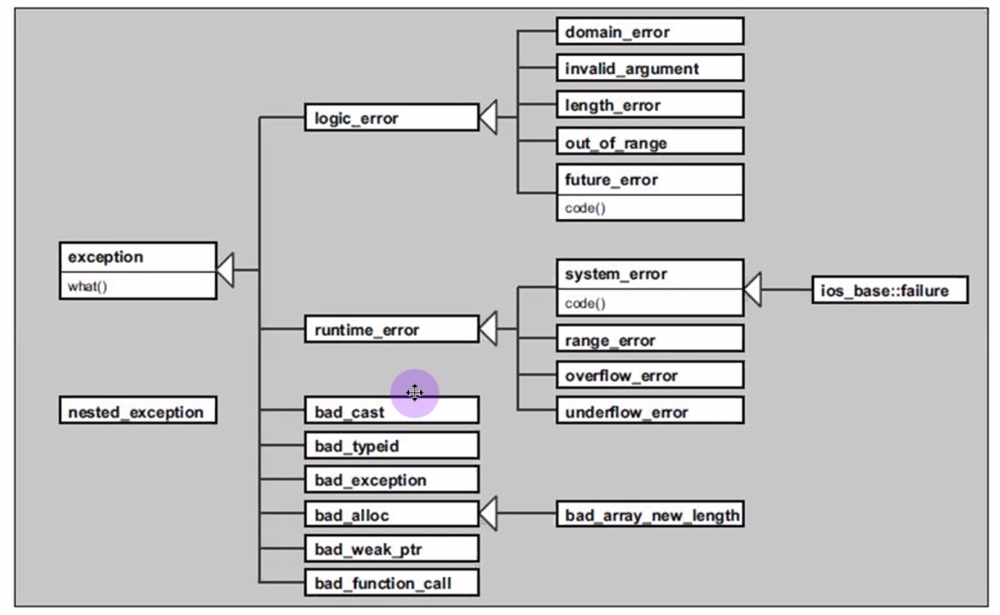

# Lecture 26 (03 December 2019)

# Exception Handling cont.

- catch bloklari daha ozel olanlar yukarida, genel olanlar asagida olacak sekilde yapilmali
- aksi halde daha ozel olan exception catch lere girmez
- std deki butun exceptionlar `std::exception` turundendir
- exception yakalanmadi ise ya try blogu yoktur yada exception gonderilmemistir(runtime hatasi mesela)
```cpp
std::vector<int> ivec; 
ivec.at(10); // exception
ivec[10]; // no exception, runtime error
```


- `catch(...){ }` 
    - ... ellipsis atomu
    - catch all diye adlandiriliyor
    - bunun dejavantaji: artik hata nesnesinin turunun bilinme sansi yok
    - bunu kullanacaksak tabi ki en sona bunu yazmaliyiz

- uncaught exception
    - program terminate eder
    - programin calismaya devam etmesi icin butun exceptionlarin yakalanmasi gerekir
    - her durumda programin calismasini beklemek cok mantikli degil
    - terminative (sonlandirmak) bu durumda onlem alip zararsiz sekilde, clean up vs yapmak icin onemli
    - resumptive (devam ettirmeye calismak)

- throw da gonderilen nesne bizim olusturdugumuz nesne degil
- derleyici bu nesneyi kopyalayip kullaniyor
- eger nesne class turunden ise
    - sinifimizin copy ctor u cagrilacak
    - derleyici kendi urettigi nesneyi gonderecek
    - derleyicinin nesnesi catch blogunun sonuna kadar hayatta kalacak

- exception yakalanmazsa terminate cagrilir ve o da abort u cagirir
- terminate davranisi degisitrilebilir
- `terminate_handler set_terminate(terminate_handler)` donus degeri abort func
- C++11 ile eklenen `terminate_handler get_teminate(void)` terminate'in cagiracagi func i donduruyor

- exception yakalaninca ne oluyor
    - pogramin devam ettirilmesi sansi var
    - stack unwinding (yiginin geri sarimi) garantisi var
    - eger bir exception handler a girerse, handler a girmeden, olusturulan butun otomatik omurlu nesneler icin dtor cagrilacak
    - Bu nedenle RAII cok onemli, ctor kaynak allocate eder dtor geri verir
    - dynamic omurlu nesneler icin bu mekanizma ise yaramiyor, raw ptr yerine smart ptr kullanilirsa bu duzeltilebilir `std::unique_ptr<> yada std::shared_ptr<>`
    - kaynak kullanimi dogrudan yapilirsa burada da exception dan sonra kaynak geri veriliyorsa bu durumda kacak olusacak, eger bunu bir nesne ile wrap edersek bundan kurtulabiliriz, ornegin dosyayi dogrudan acmak yerine bunu bir class a yaptirmak, dtor da dosya kapatilacak
    - eger exception yakalanmazsa derleyici stack unwinding kodu olusturmak zorunda degil.

- exception safety
    - bir program exception gonderildiginde durumunu koruyorsa
    - kaynak sizdirilmiyorsa
    - exception safe denir
  
- Bir func hata yonetimi(exception) acisindan kategorilere ayriliyor
    - En minimal garanti Basic Guarantee
        - Programin durumu degisebilir fakat tutarli bir durumda kalacak
        - kaynak sizintisi olmayacak
        - hicbir nesneyi gecersiz (invalid) durumda birakmayacak
        - o func a gonderilen nesnelerden yada icinde olusturulmus nesnelerden dolayi kaynak sizintisi olmayacak
        - nesnelerin degeri degisemez demiyor invalid olmayacak diyor
    - Strong Guarantee
        - Programda hicbir durum degisikligi olmayacak
        - commit or rollback (ya isini yap yada hicbirseyi bozmadan birak)
        - program tutarli bir durumda kalacak
        - kaynak sizintsi olmayacak, nesnelerin degeri de degismeyecek
        - vector un push_back func i mesela
    - Nothrow Guarantee
        - isini yapma garantisi veriyor
        - hata gondermeme garantisi var
        - hata gonderilirse kendi yakalayip halledecek
        - exception propagate etmeyecek, emit etmeyecek kendi halledecek
        - dtor, swap func vs nothrow olmali

### CTOR ve Exceptions
- Exception ihtimalinin en yuksek oldugu yerler
- preconditionlar, postconditionlar saglanmiyorsa, invariantlar tutmuyorsa exception throw etmeli, cunku saglikli sekilde construct edemeyecek
- eger exception gondermezse ve programi sonlandirmazsa zombie object olacak
- hayata gelmis ama islevini yerine getiremeyecek bir nesne olmus olacak
- ctorda exception gonderirken nelere dikkat etmek lazim
    - throw a kadar herhangibir kaynak allocate edilmisse, daha nesne olusmadigindan dtor cagrilamyacak kaynaklar geri verilmemis olacak
    - otomatik omurlu member ler ve ctor da tanimli degiskenler dtor lari otomatik cagrilarak verilecek
    - raw ptr kullanilirsa yada file vs gibi diger kaynaklar sinifla sarmalanmamissa bunlar geri verilmemis olacak
    - O yuzden smart ptr ler kullanmak ve class ile diger kaynaklari wrap etmekte fayda var

### DTOR ve Exceptions
- dtor kesinlikle exception throw etmemeli (syntax hatasi olmuyor throw ederse, warning olabilir)
- nothrow garantisi vermeli
- dtor herzaman noexcept keyword u ile tanimlanmis kabul edilir
- exception dtor da olusabilir ama exception propagate etmemeli
- kendisi yakalayip halletmeli
- nedeni;
    - dtor ne zaman cagriliyor, stack unwinding de, dynamic nesne icin delete cagrildiginda, otomatik omurlu nesneler icin blok sonunda, statik nesnler icin main blogu sonunda
    - yani exception oldugunda unwinding yapilirken dtor exception throw ederse `std::terminate()` cagrialcak ve programin calismasi garantisi kalmayacak

