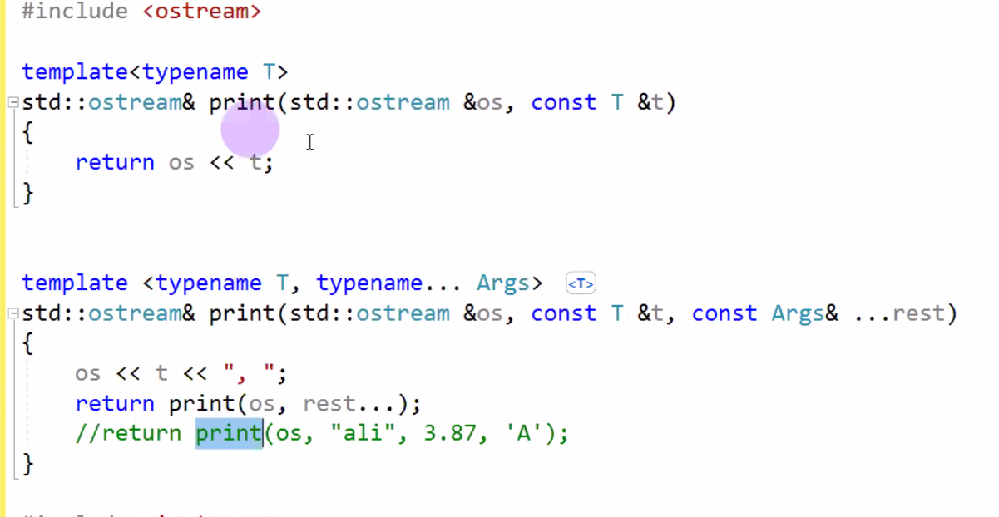
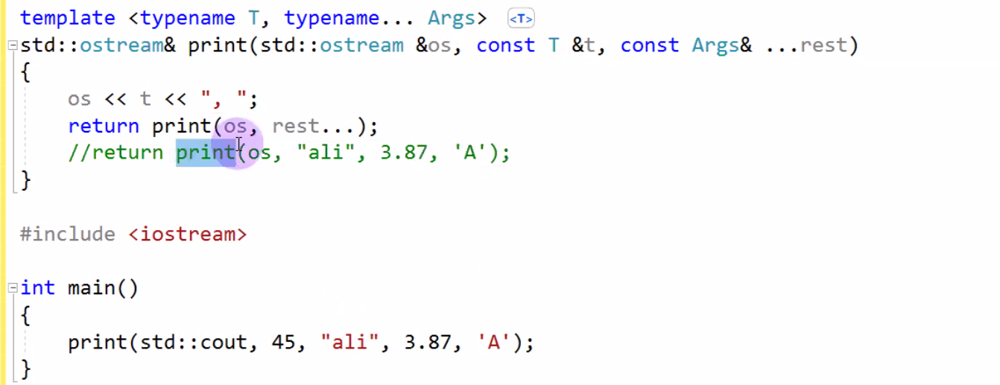
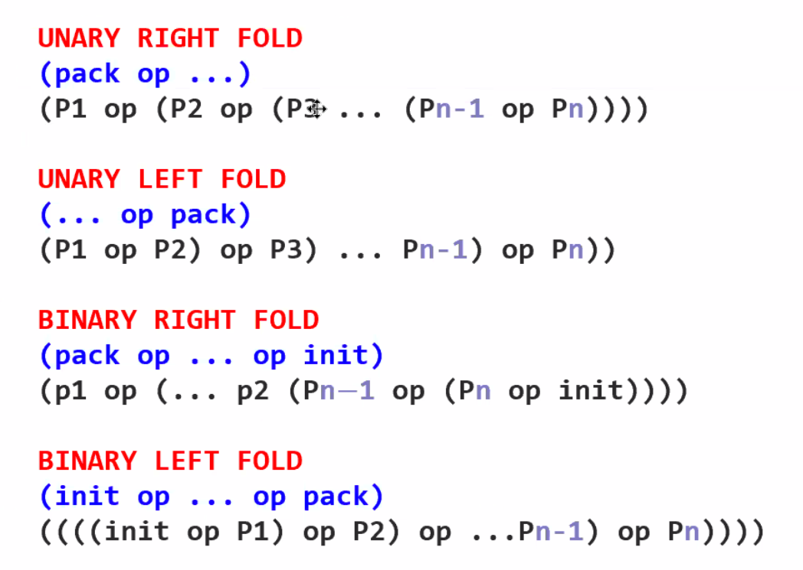

# Lecture 30 (17 December 2019)

## Generic Programlama cont

- tuple pair in coklu hali
- `tuple<int, double, string, bitset<16>> t;`
- tuple value initilize edecek, default ctor yada numeric tiplerde 0
- default ctor olmak zorunda degil
`tuple<int, double, string, bitset<16>> t{12, 34.5, "Ali"s, 15u};`
- global get func in ile elemanlara ulasilabilir
`get<0>(t); // int e ulasiyor`
- get reference donduruyor
- daha sonra eklenen ozellikle tur belirterekte erisebiliriz
`get<int>(t); // int e ulasiyor`
- ayni turden birden fazla varsa bu ozellik kullanilamaz, syntax hatasi
- yardimci bir func var make_tuple, tuple olusturmak icin
`auto t = make_tuple(12, 34.5, "Ali", 15u); // yukardaki gibi tuple tanimlanmis oldu`
- en cok kullanildigi yerlerden biri func larin geri donus degeri olarak
- func in geri dondurdugu tuple i dogrudan degiskenlere atamak icin c++17 de eklenen structural binding kullanilir
`auto [ival, dval, s, c] = foo(); // foo nun donusu make_tuple(12, 4.9, "ali", 'Z')`
- daha az yazarak ve daha efektif bu isi yapmis olduk
- ival, dval, s ve c tanimlanmis oldu
- structural binding bircok yerde kullaniliyor
- struct donen bir func da mesela
- yada dizide

```cpp
int a[] = {10, 34, 67};
auto[x, y, z] = a;
```

### Variadic templates

- compile time da derleyicinin degisken sayida arguman kullanmasina olanak veren bir yapi
- sinif sablonu yada func sablonu variadic olabilir
- mesela tuple variadic bir sinif sablonu

```cpp
template<typename ...>
class TypeTeller;

template<typename ...Ts> // ... ellipsis atomu, Ts isim anahtar sozcuk degil, en cok kullanilan isimler Types, Args, template parameter pack
void func(Ts ...args) // Ts ...args function parameter pack, bir yada daha cok argumani olabilir
{
    /// code
    sizeof...(Ts);
    sizeof...(args); // sabit constexpr olusturan yeni bir sizeof func C++11 ile eklendi
    TypeTeller<Args...> x; // burada compile time hatasi alarak compiler in hangi imza ile kod olusturdugunu gorebiliriz
}
int main()
{
  func(12, 5.6, "alican"); // int, double, const char* olarak turler cikarilacak
}
```

- pack expansion (paketin acilmasi)
  - Ts... (tempalte params pack )ifadesini compiler (expand ettiginde) virguller ile ayrilmis liste haline donusturuyor ornegin int, double, const char*
  - std::tuple<Args...> seklinde kullanmamiza yardimci oluyor
  - args... (function params pack) ifadesinin yerine derleyici (expand ettigimizde) parametre listesine donusturuyor bir func i cagirabiliriz `foo(args...);`
  - {args...} kume parantezi icinde acilmis liste olacak, `int a[] = {args...};` int yada int e donebilecek tur ise ilk deger vermede kullanmis olacak
  - {args...} initiliazer list olarak kullanilabilir, `std::initiliazier_list<int> x{args...};`
  - gcc de pretty func var ve template icinde cagrildiginda func in imzasini yaziyor `__PRETTY_FUNCTION__`
  - windows daki karsiligi `__FUNCSIG__`



- c++17 ile gelen fold expression
- 4 bicimi var
  - unary right
  - unary left
  - binary left
  - binary right


