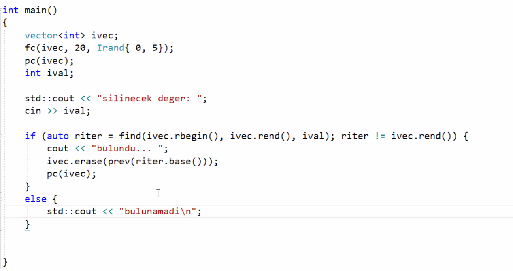
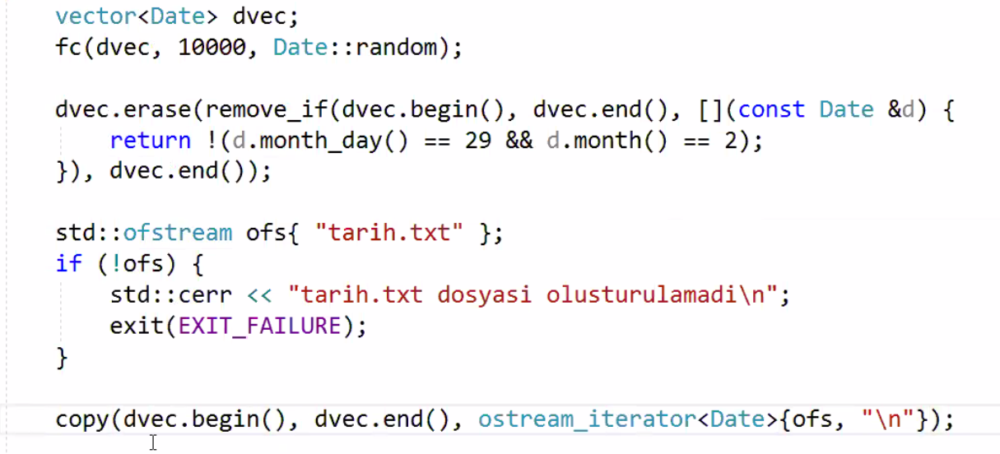
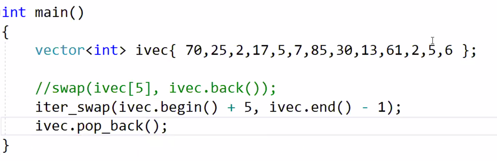
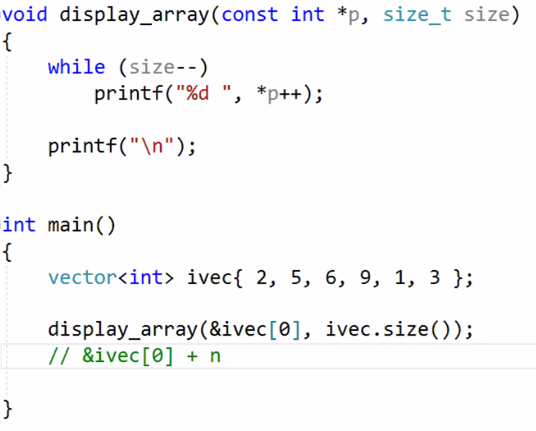
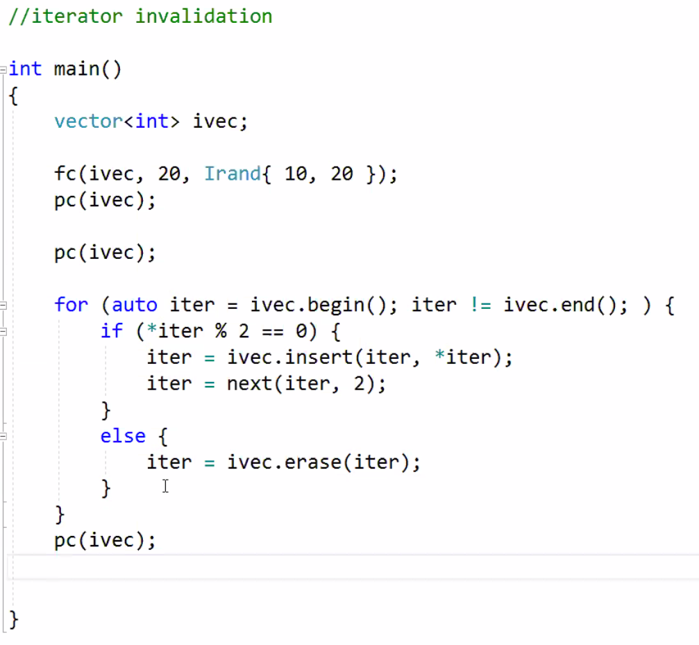

# Lecture 38 (16 January 2020)

## Containers

### vector

#### emplace functions

- modern cpp nin en onemli eklentilerinden

- normal ekleme function lari kopyalama islemi yaparak ekleme yapiyor

- emplace func lar perfect forwarding ile dogrudan nesnenin kendisini ekliyor

```cpp
vector<Person> pvec;
pvec.emplace_back("Name", "Surname", Date{12, 1, 1989}); // push_back yerine
pvec.emplace(pvec.begin(), "Albert", "Einstein", Date{1, 1, 1912}); // insert yerine
```

#### erase functions

- hicbir silme func i capacity i dusurmez
- capacity i dusurmek icin eskiden swap trick yapiliyordu ama artik gerek kalmadi shrink_to_fit function var artik

- silme func larinin geri donus degeri silinmis ogeden sonraki ogenin konumunu gosteren iteratordur


```cpp
svec.erase(svec.begin());
svec.erase(svec.begin()+idx); // silinecek ogenin index i
auto iter = svec.erase(svec.begin()); // geri donus degeri iterator, silinen son ogeden sonraki ogenin konumu
```


- pop_back() geri donus degeri yok

- klasik mulakat sorusu, aranan ogeyi sondan silme



- belirli sarti saglayan ogelerin tumunu silmek



- `ivec.clear();` tamamini silmek icin

- `ivec.resize(0);` boyle de tamamini silebiliriz
  - resize a size dan daha kucuk deger verildiginde silme yapilmis olur

- `svec = {};` atama yaparakta tamamini silebiliriz
  - `svec.assign({});` atama ile benzer sekilde

- vectordeki fazla kapasitenin trim edilmesi, kapasitenin buzulmesi, size degerine cekmek
  - `ivec.shrink_to_fit();`
  - eskiden boyle yapiliyordu `vector<int>(ivec).swap(ivec);` (swap trick)

- vector den bir oge silinecek fakat sabit karmasiklikla silinecek, constant complexity



#### vector ile ilgili diger detaylar

- C apisine vector u dizi olarak gonderme ornegi



- bunun yerine `ivec.data()` kullanilabilir
  - global versiyounu da var C++17 ile `data(ivec)`, 
  - `ivec.begin()` de dogrudan kullanilabilir ama bunun garantisi yok iterator ptr ise sadece gecerli, farkli platformlarda farkli implement edilmis olabilir, bir platformda calissa dahi kullanilmamali

- `vector<bool>` 
  - ekstra func lari var flip mesela
  - ama bool turunu tutmuyor bir proxy class turunu tutuyor
  - bazi kisitlari var, vector un diger acilimlarinin kullanildigi her yerde kullanamiyoruz
  - bunun yerine bitset kullanmak daha iyi olabilir
  - deque nun bool acilimi gercekten bool tutuyor, vector bool acilimi yerine kullanilabilir

#### iterator invalidation for vector

- bazi container func lari iteratorlari invalid ediyor

- vector icin iterator invalid funclari
  - reallocation a neden olan insert, butun iteratorlar, ptr lar ve reference lar invalid olur
  - cunku reallocation vectorun arkasindaki dynamic diziyi kopyaliyor
  - ekleme sonrasi eklemenin yapildigi konum ve sonrasinin iteratorleri invalid olur
  - silme isleminde de ayni sekilde silinen oge ve sonraki ogeleri gosteren iteratorlar invalid olur

- tek sayilari sil, cift sayilardan bir tane daha ekle



### deque double ended queue

- bazi durumlarda dynamic diziye (c++ da vector) tercih edilebilecek bir yapi

- genellikle ekleme/silme islemleri bastan ve sondan yapiliyorsa
  - vector kullanildiginda, sondan ekleme constant time iken bastan ekleme linear complexity
  - hem bastan hem sondan constant time ve index ile erisim de constant time istiyorsak deque bunu sagliyor

- dynamic arrays of dynamic arrays diye dusunebiliriz

- bir ogeye erismek icin iki dereferencing yapiliyor gibi, once ilgili dynamic array adresine oradan da ilgili ogeye

- deque da reallocation yok

- silme isleminde de gereksiz bellek alani bloke etme soz konusu degil, kapasitenin yuksek kalmasi mesela vector daki gibi degil, dynamic array bloklari otomatik release edilmis oluyor

- reallocation olmadigi icin tasima maliyeti yok

- bastan ve sondan ekleme yapilmasinda diger ogeleri gosteren iteratorlarda iterator invalid olmuyor

- interface i vector ile birbirine cok cok yakin (hemen hemen ayni)

- farkli olan noktalar
  - push_front, emplace_front, pop_front funclari ekstra olarak var
  - capacity ve reserve func lar yok, ihtiyacta yok zaten

- vector kullandigimiz yerlerde kodda gerekirse kolaylikla deque ye gecebiliriz
  - interface cok cok benzedigi icin

- shrink_to_fit kullanilmasinin tek nedeni herbir chunk in dynamic adresinin tutuldugu ptr dizisinin shrink edilmesi ihtiyaci, buradaki kullanim vector den farkli

#### iterator invalidation for deque

- ekleme islemi bastan yada sondan yapilmiyorsa, tum iteratorler, ptr ler ve ref ler invalid olacak

- ekleme islemi iki uctan yapiliyorsa, ptr ve ref lar gecerli olacak ama iteratorler invalid olacak

- silme isleminde de uclardan yapilmiyorsa tum iter ptr ref ler invalid

- silme uctan ise sadece onlari gosteren ptr ref iter lar invalid olacak digerleri gecerli
