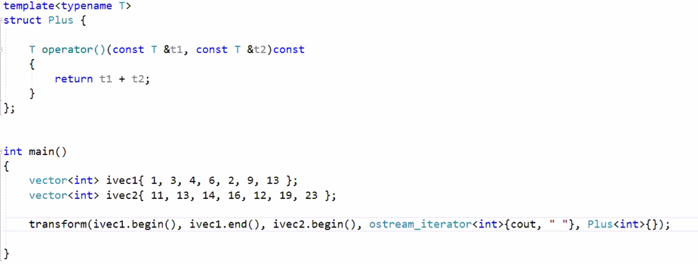
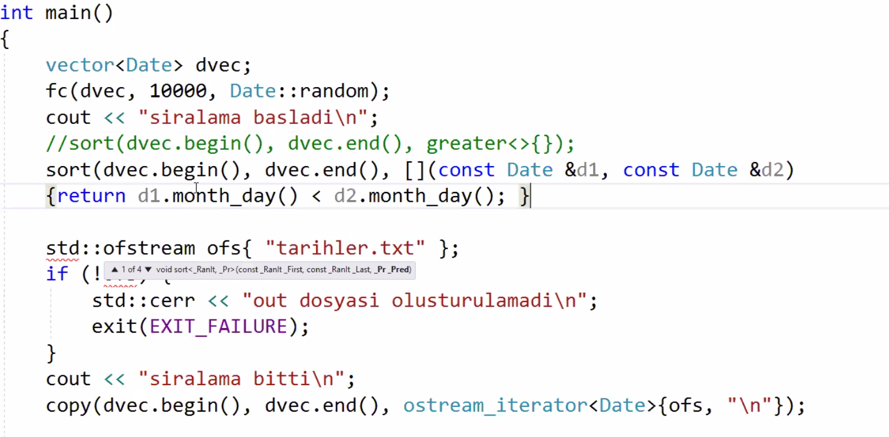
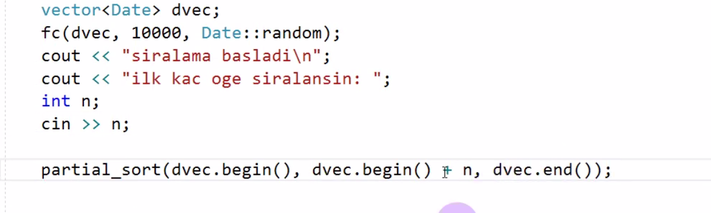
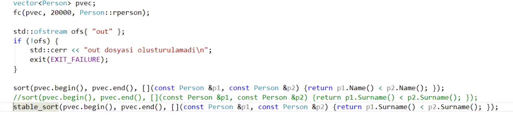
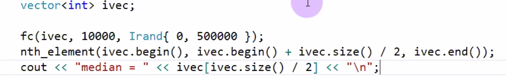
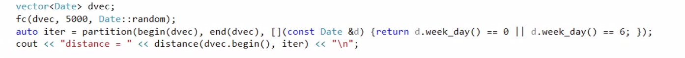
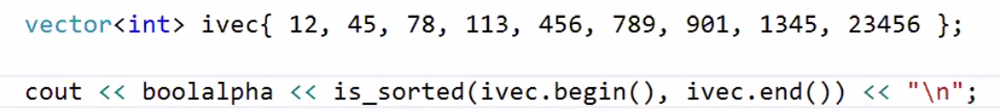
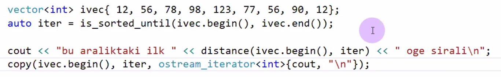
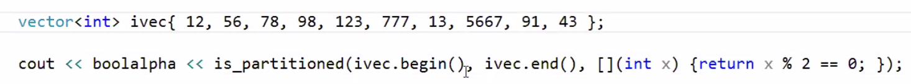

# Lecture 39 (21 January 2020)

## Some STL Algos

### Standard function obejcts

- Functor siniflar vardi onceden gordugumuz
  - operator func i implement etmis siniflar
  - algoritmalar kullanirken bu siniflarin gecici nesnesi ile functor parametresi yapabiliriz

- STL de en cok kullanilan functorlardan viri `less`
  - `sort(svec.begin(), svec.end())`
  - `sort(svec.begin(), svec.end(), less<string>{})`
  - yukardaki iki sey ayni
  - `sort(svec.begin(), svec.end(), greater<string>{}) // buyukten kucuge yapmak icin`
  - lambda karsiligi `sort(svec.begin(), svec.end(), {return s2<s1;})`
  - functor daha okunabilir, anlasilabilir

- burada kullandigimiz greater less gibi class lar standart function objects 

- C++14 ile `sort(svec.begin(), svec.end(), less<>{})` bu sekilde de kullanilabilir
  - tur cikarimi derleyici tarafindan yapiliyor
  - buna transparent functor deniyor

- standard functors
  - plus
  - minus
  - multiplies
  - divides
  - modulus
  - negate
  - logical operators
  - bitwise operators
  - get from screenshots

### Sorting Algorithms

- STL de siralama icin cok sayida algorithm var
- Pratikte cok kullaniliyor

- Onemli bazi sort algorithms
  - reverse
  - reverse_copy
  - sort
  - partial_sort
  - stable_sort
  - is_sorted
  - is_sorted_until
  - partition
  - stable_partition
  - partition_copy
  - partition_point
  - is_partitioned
  - nthelement

- Sorted range algorithms var birde
  - sorting algo ile karistirilmamali
  - bunlar sorted veri yapilari uzerinde calisanlar

- reverse
  - bir veri yapisini ters ceviriyor
  - bidiretional iterator istiyor
  - sonu copy ile bitenler islemi yapilmis gibi baska bir adrese yaziyor

- sort
  - en cok kullanilan algoritmalardan biri
  - cok sayida sorting algorithms var quick sort vs gibi
  - STL de hangi sorting algo nun kullanilacagina dair bir kosul yok
  - C++ standartlari karmasiklik uzerinde bazi sartlar belirliyor
  - compiler bazinda ciddi farkliliklar olabilir
  - genellikle quick sort algoritmasi kullaniliyor
  - ortalama da O(Nlog(n)) worst case de O(n^2)
  - simdilerde daha cok intro sort algo kullaniliyor
  - duruma gore quick sort yada heap sort kullaniyor
  - heap sort Nlog(n) i garanti ediyor, ama 2-5 kat ortalama da daha yavas kaliyor
  - STL deki sort algo random access iterator istiyor
  - kucukten buyuge siraliyor, less functor u kullanarak
  - bir overloadu otomatik olarak less kullaniyor, diger bir overload u bizden functor alarak siraliyor

- ilk n tane elemanin sirali olmasina ihtiyacimiz varsa sort yerine partial_sort kullanmak lazim
  - geleneksel olarak heap sort kullaniyor
  - bir range deki ilk n ogeyi sirali hale getiriyor
  - random access iterator istiyor

- stable_sort algo
  - kararli siralama demek
  - siralamadan onceki izafi durumlarini koruma garantisi veriyor
  - sort key siralamaya konu olan deger
  - bir suru sort key varsa (mesela isimler gibi)
  - siralandiktan sonra ayni sort keye sahip ogelerin siralanmadan onceki siralari korunuyor
  - geleneksel olarak merge sort algo kullaniyor Nlog(n) karmasikliginda, ilave bellek alani kullaniyor
  - zaten siralanmis bir veri yapisinda baska bir sort key e gore ikinci siralama yapildiginda ilk siralamanin korunmasinda ise yariyor
  - bidirectional iterator istiyor

- nth_element ?
  - n ninci elemana gore partition yapiyor
  - oncekilerin hepsi kucuk, sonrakilerin hepside buyuk olacak
  - median hesaplamada kullaniliyor en cok
  - intra select algo kullaniliyor, karmasiklik o(n)

- partition
  - O(n) karmasiklikli algo
  - bir kosulu saglayanlar ve saglamayanlar diye ayrilmasi
  - kosulu saglayanlar basta
  - forward iterator istiyor
  - geri donus degeri partition point, kosulu saglamayan ilk oge konumu, hepsi sagliyorsa donus end

- is_sorted ve turevleri
  - bir range in sirali olup olmadigini boolean donuyor
  - forward iterator ile calisiyor

- is_sorted_until
  - siralamanin bozuldugu konumu donuyor
  - forward iterator ile calisiyor

- is_partitioned

## Containers

### List container std::list

- doubly linked list data structure

- C++11 e kadar tekli bagli liste sinifi standart degildi
- Modern c++ da std::forward_list ile eklendi

- her ikisi de sequence containers

- bidirectional iterator sagliyor

- bir veri kadar alan gerekli birde iki ptr, onceki ve sonraki adresler icin
- asiri bellek tuketimi oldugundan cok tercih edilmiyor
- her node ayri ayri allocate ediliyor
- cache miss riski yuksek, ustunde islem yapilacak verinin cache de olmamasi durumu
- vectordeki gibi topluca allocate edilmedigi icin cache friendly degil
- ilk ve son eleman constant complexity, indexle erismede O(N) karmasiklikli
- indexle ersiimde bagli liste dejavantajli, dynamic diziler tercih edilir
- bagli listenin en onemli avantaji herhangi bir bilinen konuma ekleme ve silme constant complexity (time)
- ptr, ref, iterator invalidation olayi bagli listelerde olmuyor
- stl deki list sinifinin vector dequeu de olmayan interface func lari var, ogeleri swwap etmek yerine dugum icindeki ptr leri swap etmek icin
