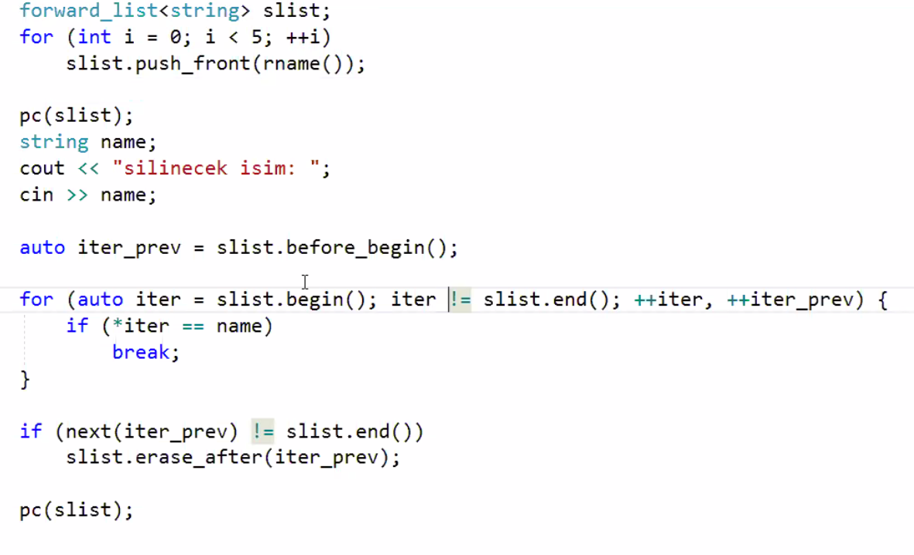
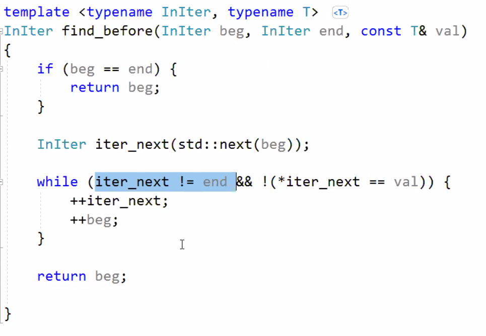
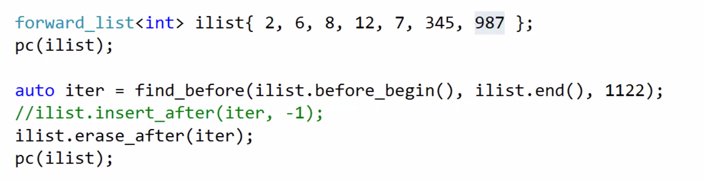
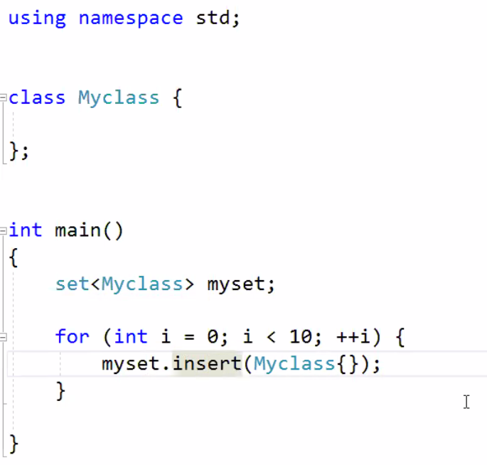
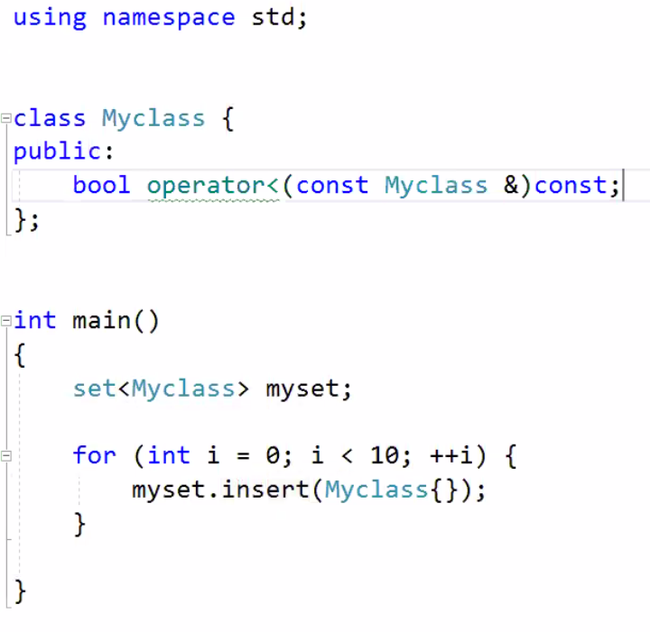

# Lecture 40 (23 January 2020)

## Containers

### List container std::list

- ctor grubu vector ile ayni

- reverse, sort, unique, merge, remove ve remove_if member func olarak var, bunlar algorithms yerine kullanilmali

- splice dugum yada dugumleri bir yerden alip baska yere koyuyor

```cpp
list<string> slist;
// fill container here

slist.push_front("something_front");
slist.push_back("something_back");
// lsite iteratoru + - ile kullanilmaz, random access iterator degil
slist.insert(prev(slist.end()), "something_before_end");
slist.insert(next(slist.begin()), "something_after_begin");
// insert te geri donus degeri eklenen ogenin konumu

// ilk ogeyi silme
slist.pop_front();
// ilk ogeyi silme
slist.erase(slist.begin());
// sondan bir oncekini silme
slist.erase(prev(slist.end(), 2));
// ilk ve son haric hepsini silme
slist.erase(next(slist.begin()), prev(slist.end()));

// reverse, geri donusu degeri yok
slist.reverse();

// degerle silme islemi, remove ve remove_if
// geri donus degeri yok, C++20 ile donus degeri silinen oge sayisi olacak
list<int> ilist;
// sill container with random values beetween 0-10
int ival; // silinecek deger
ilist.remove(ival);

size_t low, high;
slist.remove_if([low, high](const auto &s){return s.lenght() >= low && s.lenght() <= high;});

// sort
slist.sort(); // less kullanan overload u
slist.sort(greater<string>{}); // functional baslik dosyasindan greater
slist.sort(greater<>{}); // c++14 ile transparant olarak kullanilabilir

auto fcmp = [](const auto &s1, const auto &s2)
{
    return s1.length() < s2.length() || s1.length() == s2.length() && s1 < s2;
}
slist.sort(fcmp);


// unique, ardisik esdeger ogelerin sayisini teke indiriyor
list<Data> dlist;
// fill container with randm dates
dlist.unique([](const Date &d1, const Date &d2){return d1.week_day() == d2.week_day();}); // haftanin gunleri ayni ise ayni kabul edilip unique hale getirecek

// merge, sirali birlestirme, iki listenin birlesmesi icin ikisininde ayni ilke ile siralanmis olmasi gerekiyor
list<string> slist1;
list<string> slist2;
// fill containers with random names

// iki list te ayni sekilde siralandi
slist1.sort();
slist2.sort();

slist1.merge(slist2); // slist2 bosaldi slist1 2 ile birlesti

// splice, sirali olmasi gerekmiyor, amac bir listeden dugumu koparip digerine eklemek
list<string> slist1;
list<string> slist2;
// fill containers with random names
slist1.splice(slist1.begin(), slist2); // ikinci list birinci listenin basina eklendi
slist1.splice(slist1.begin(), slist2, slist2.begin()); // ikinci listenin sadece birinci elemani

```

### forward_list container

- tekli bagli liste
- dugumde data ve sadece bir ptr var, sira olarak kendinden sonraki dugumu gosteriyor
- son ogenin adresini tutan anchor yok, listte iki tane anchor vardi (ilk ve son dugum adresleri)
- mulakatlarda cok soruluyor
- bidirectional iterator yok
- forward iterator kategorisinde
- algoritmalar kullanilirken buna dikkat edilmeli
- c++11 ile eklenen bir container
- temel amaclardan biri de, c de yazilmis bir tekli bagli listeden verim acisindan farki olmamasi
- yukardaki nedenden size() uye func i yok
- size i ogrenmek icin distance algoritmasi kullanilabilir

```cpp
forward_list<int> list;
// bildigimiz konuma insert edemedigimizden, insert yok
// elimizdeki konumdan sonrakine ekleme yapabiliriz teknik olarak
list.insert_after(list.begin(), 12);

// en basa eklemek icin push_front kullanabiliriz
```



- ismi find_before olan template kodu yazin





### Associative containers

- iliskisel kaplar

- ikili arama agaclari (binary tree)

- olog(n) karmasikliginda ogelere erisim oluyor

- 4 tane container var
  - set baslik dosyasi set
  - multi_set baslik dosyasi set
  - map baslik dosyasi map
  - multi_map baslik dosyasi map

- set var mi yok mu sorgulamasi durumunda kullaniliyor
  - varsa o degere ulasiyoruz

- multi_set ayni deger birden fazla oldugunda 

- map te key e karsi value ya erisilir
  - icinde pair tutan bir set gibi dusunulebilir

- multi_map te bir key den birden fazla olabilir

- dugumlerde data ve kendinden kucuk ve buyuk dugumler icin iki tane adres tutuyor

- ekleme ve silmeyi deger ile yapiyoruz
- konum kullanamiyoruz

- iki nesnenin equavalance sorgulama
  - `!(a < b) && !(b < a)` bu durumda iki deger esittir
  - `!(a op b) && !(b op a)` bu durumda iki deger esittir
  - var mi yok mu, ekleme vs islemleri icin boyle bir karsilastirma gerekli

- iteratorler bidirectional 

- sequence containerlardaki bazi ctor lar burada yok

```cpp
set<int> iset;
// set<int, greater<int>> iset; // bu durumda buyukten kucuge erisilecek

Irand myrand{10, 50};

for (int i = 0; i<100; ++i)
{
    iset.insert(myrand());
}

// ayni degerler eklenemdigi icin size 100 olmayabilir
// multi_set olsaydi size 100 olacakti
cout<< "size: " << iset.size() << "\n";

// karsilastirma ile icinde gezildiginden kucukten buyuge dogru yazilacak
for (auto x = iset)
{
    cout << x << " ";
}


// different examples
set<string, greater<string>> sset;
set<string, greater<>> sset; // transparent olarak kullanilabilir
// fill container with random name
```

- karsilastirma olarak lambda kullanirken, fcmp daha once yazilan lambda
  - `set <string, decltype(fcmp)> myset(fcmp);`

- set te tutulacak class larin less ile karsilastirilabilecek yapida olmasi gerekir
- syntax hatasi


- after fix


- eger set te default tur argumani olarak less kullaniyorsak sette tutulan ogeler less ile karsilastirilabilir olmak zorunda

- default, copy, move, range, init list ctor lar var, size_t paramli ve fill ctor yok
- asagidaki func lar ekstra set te olanlar
  - count, emplace_hint, equal_range, extract, find, key_comp, lower_bound, upper_bound, value, count

- set teki ogeyi degistiremeyiz, veri yapisini corrupt etmis oluruz

- iterator ile dolasabiliriz yada bir deger ile arama yapabiliriz


```cpp
set<string> myset;
string name; // aranacak deger
// fill container with random names
// kac tane oldugu, sette ya 0 ya 1, multiset te birden fazl olabilir
if(myset.count(name))
{
    cout << "var";
}
else
{
    cout << "yok";
}

// donus degeri iterator, varsa ogenin konumu yoksa set nesnesinin end nesnesinin iteri
auto iter = myset.find(name);
if (iter != myset.end())
{
    cout << *iter << " bulundu";
    cout << distance(myset.begin, iter);
}

// C++17 ile gelen eklenti if with init
// yukarida iter scope leakage oldu
if (auto iter = myset.find(name); iter != myset.end())
{
    cout << *iter << " bulundu";
    cout << distance(myset.begin, iter);
}

// multi sette eger ayni deger birden fazla varsa arama ilk degeri bulmayi garanti ediyor
```

- strick weak ordering prensiplerine uymasi gerek karsilastirma kriterimizin
  - antisymmetric; a op b dogru ise b op a yanlis olmak zorunda (op bizim karsilastirma operatorumuz)
  - transitive; a op b dogru ise b op c dogru ise a op c dogru olmasi gerekir
  - irreflexive; a op a her zaman yanlis olmak zorunda
  - transitivity; !(a op b) && !(b op a) dogru ise ve ayni zamanda !(b op c) && !(c op b) dogru ise !(a op c) && !(c op a) da dogru olmak zorunda (yani a b ye esit ise b de c ye esit ise a c ye esit olmak zorunda)

- yukaridaki sart set map ve multi leri icin karsilastirma olarak kullanilacak op un ozellikleri