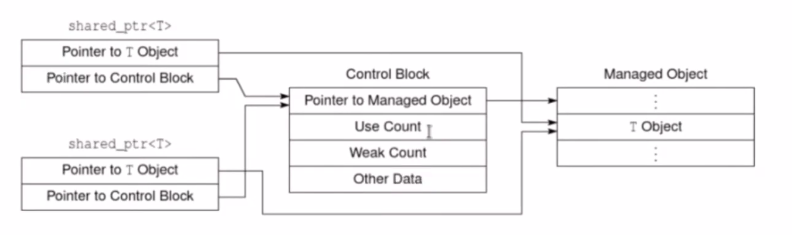

# Lecture 47 (18 February 2020)

## Smart pointers

### shared_ptr ve weak_ptr

- shared ptr nin unique ptr ile hayata baslamasi mumkun, tersi mumkun degil
- mumkun olan her zaman unique ptr tercih edilmeli
- shared ptr kopyalamaya da tasimaya da acik
- shared ptr conrol blogu tutuyor ve iki tane ptr var icinde


- make_shared ile shared ptr olusturuyoruz, dogrudan new cagirmaktan daha guvenli

```cpp
shared_ptr<Nec> sp(new Nec{1, 2, 3}); // arkada dynamic control blogu olusuyor

// make_shared exception handling acisindan daha guvenli
// make shared optimize edilebilir, controlled object i icinde barindirabilir
auto sp1 = make_shared<Nec>(1, 2, 3); // sinifin ctorunu cagirip dynamic object olusturuyor
auto sp2 = make_shared<Nec>(10, 20, 30); // sinifin ctorunu cagirip dynamic object olusturuyor

// kopyalamaya acik, birbirine atanabilir, nullptr degilse sayaclar otomatik ayarlanir
auto sp1 = sp2; // sp1 in sayaci azalacak, sp2 nin sayaci artacak
auto sp = sp2;  // sp2 nin sayaci artacak
```

- unique_ptr de deleter'e denk gelen ikinci template parametresi yok
- deleter ctor a parametre olarak veriliyor

```cpp
shared_ptr<Nec> sp(new Nec{1, 3, 5}, [](Nec *p) {cout<< p << "deleted\n";});
```

- hangi durumlarda kontrol blogu olusturulur
  - bir shared ptr nesnesini dogrudan dinamik nesnenin adresi ile hayata getirildiginde
  - nullptr olmayan bir unique ptr ile shared ptr nesnesi hayata getirildiginde
  - make_shared ile shared ptr hayata getirildiginde

```cpp
auto uptr = make_unique<Nec>(1, 2, 3);
shared_ptr<Nec> sptr(move(uptr));
```

- shared_ptr nesnesinde referens sayacinin degerini `use_count()` ile ogrenebiliyoruz

```cpp
auto sp1 = make_shared<Nec>(1, 2, 3);
cout<< sp1.use_count() << endl; // 1 olmali

auto sp2 = sp1;
cout<< sp1.use_count() << endl; // 2 olmali
cout<< sp2.use_count() << endl; // 2 olmali
```

- `operator bool()` func i var

```cpp
auto sp = make_shared<Nec>(1, 2, 3);
cout << (sp ? "dolu" : "bos" ) << endl;
sp.reset();
cout << (sp ? "dolu" : "bos" ) << endl;
```

- karsilastirma operator func lari var
- -> operator func i var

- C++20 de kaldirilan `unique()` func i var, use_count un bir olup olmadigina bakiyor denebilir

- referance sayaci atomik turden

- weak_ptr ve enable_shared_from_this yardimci siniflari var
  - bunlar shared ptr siniflari degil

- CRTP curiosly recurring template pattern

```cpp
template<typename T>
class Base
{

};

class Nec : public Base<Nec>
{

}
```

- CRTP oruntusu ile enable_shared_from_this kullanma

```cpp
class Nec : public std::enable_shared_from_this<Nec> 
{
    void mf()
    {
        // bu func in dinamik omurlu bir Nec nesnesi icin cagrildigini biliyoruz
        // *this nenesini gosteren bir shared_ptr olusturulmus durumda
        // o shared_ptr nin kopyasini olusturmak istiyoruz ama o shared_ptr ye dogrudan erismimiz yok
        shared_from_this();
        // eger ortada henuz bir shared ptr olmadan bunu cagirirsak exception throw edilecek
    }
}

int main()
{
    auto sp1 = make_shared<Nec>(1, 2, 3);

    auto sp2 = sp1->shared_from_this(); // ayni dinamik omurlu nesneye bir shared ptr daha
}
```

- weak_ptr nesnesi shared ptr den bize counter i artirmadan weak_ptr verecek
- icerik operatoru yada -> operatoru yok
- ilgili dinamik nesneye erisemiyoruz
- gosterdigi kaynagin hayatta olup olmadigini kontrol edebiliriz
- shared_ptr yi weak_ptr den olusturabiliriz

```cpp
auto sp = make_shared<Nec>(1, 2, 3);
weak_ptr<Nec> wp{ sp };
cout<< sp.use_count() << endl; // 1 olmali, artmamis olmali

auto sptr = wp.lock(); // eger wp nin iliskili oldugu kaynak delete edilmis ise lock nullptr olan bir shared_ptr verecek
if(sptr != nullptr)
{
    cout << "kaynak hala hayatta\n";
    cout << *sptr << endl; // weak_ptr nin lock inin dondugu shared_ptr ile kaynaga ulasiyoruz
}
```

- dynamic cast operatoru

```cpp
// C de legal degil, c++ da legal
// logic kontrole tabi tutuluyor
// scope u daraltmak icin dynamic cast operatorunde kullaniliyordu
if (T x)
if(int *p = func()) // func donusu ataniyor ve ptr null mu diye kontrol edilmis oluyor
{

}

if (Mercedes *p = dynamic_cast<Mercedes*>(carptr))
{

}

// yukardaki kodun aynisi, scope leak olmadan yapmamin yolu
if(auto sptr = wp.lock())
{

}

// diger bir yol
shared_ptr<Nec> sp(wp);
// sp yi dogrudan wp ile hayata getiririz, eger wp kaynagi delete edilmisse exception throw edilecek (bad weak ptr)
```

- cyclic reference durumunda kullaniliyor

```cpp
#include<iostream>
struct A;
struct B;

struct A
{
    std::shared_ptr<B> bptr;
    ~A() { std::cout << "A is deleted!\n"; }
};

struct B
{
    std::shared_ptr<A> aptr;
    ~B() { std::cout << "B is deleted!\n"; }
}

int main()
{
    using namespace std;
    shared_ptr<A> ap(new A);
    shared_ptr<B> bp(new B);

    // bu durumda ikiside delete edilemiyor
    ap->bptr = bp;
    bp->aptr = ap;
}
```

- a nin icinde b nesnesini gosteren shared_ptr var 
- b nin icinde a nesnesini gosteren shared_ptr var
- boylece bu iki nesnede destroy olamiyor
- shared_ptr lerden bir tanesini weak_ptr yaparak bunu duzeltebiliriz

```cpp
struct B
{
    std::weak_ptr<A> aptr;
    ~B() { std::cout << "B is deleted!\n"; }

    void foo()
    {
        if(auto sptr = aptr.lock())
        {
            std::cout << "A nesnesi hayatta ve onu kullaniyorum. \n";
            sptr->fa();
        }
    }
}
```

- baska bir ornek

```cpp
class Cat
{
public:
    Cat() = deafult;
    Cat(std::string name) : mname{std::move(name)}{ }
    ~Cat()
    {
        std::cout << mname << " icin dtor cagrildi\n";
    }
    void make_friend(std::shared_ptr<Cat> spx)
    {
        sp_friend = spx;
        // cyclic ref cozumu
        wp_friend = spx;
    }
    void print() const
    {
        if(sp_friend)
        // cyclic ref cozumu
        if(auto sp_friend = wp_friend.lock())
        {
            std::cout << mname << "'in arkadasi " << sp_friend->mname << std::endl;
        }
        else
        {
            std::cout << mname << "'in arkadasi yok\n";
        }
    }
private:
    std::string mname;
    std::shared_ptr<Cat> sp_friend;
    // cyclic ref olustugu icin bunu weak ptr yapmamiz lazim
    std::weak_ptr<Cat> wp_friend;
};

int main()
{
    auto sp1 = make_shared<Cat>("minnos");
    auto sp2 = make_shared<Cat>("pamuk");

    sp1->print();
    sp2->print();

    sp1->make_friend(sp2);
    sp2->make_friend(sp1);

    sp1->print();
    sp2->print();

}
```

- shared_ptr nin onemli bir kullanim senaryosu
  - ayni nesnelerin burden fazla container'da tutulmasi

```cpp
using sptr = std::shared_ptr<Nec>;

int main()
{
    vector<sptr> svec;
    for (int i = 0; i< 10; ++i>)
    {
        svec.emplace_back(new Nec{i, i, i});
    }

    list<sptr> slist(svec.begin(), svec.end());

    for (auto sp : slist)
    {
        cout << *sp << endl;
    }

    for (auto sp : svec)
    {
        sp->set(0, 1, 2);
    }

    // ayni nesneleri tutugunu gormus olacagiz
    for (auto sp : slist)
    {
        cout << *sp << endl;
    }
}
```

```cpp
using svec = std::vector<std::string>;

class Member
{
public:
    Member() = default;
    Member(const std::string & name, std::initializer_list<std::string> list = {})
    : mname{name},
    msp{std::make_shared<svec>(list)}
    // msp{new svec{list}}
    { }

    ~Member()
    {

    }

    void add_book(const std::string & title)
    {
        msp->push_back(title);
    }
    void remove_book(const std::string & title)
    {
        if( auto iter = std::find(msp->begin(), msp->end(), title); iter != msp->end())
        {
            msp->erase(iter);
        }
    }
    void print()
    {
        std::cout << "toplam " << msp->size() << " kitap var.\n";
        for (const auto &s : *msp)
            std::cout<< s << std::endl;
    }

private:
    // bunun static member yerine boyle yapilmasinin nededni farkli nesne gruplarinin paylasimi, butun nesneler ayni member i kullanmayacak subset gibi
    std::shared_ptr<svec> msp;
    std::string mname;
}

int main ()
{
    Member m1{"clubx", {"yesil yol", "savas ve baris"}};
    Member m2 = m1;
    Member m3 = m2;
    m2.add_book("aclik");
    m3.add_book("yeni yil");
    m3.remove_book("yesil yol");

    m1.print();

    // baska grup farkli kaynagi paylasiyor
    Member m7 {"clubz", {"C language"}};
    m7.add_book("C++ language");
    Member m8 = m7;
    m8.add_book("Design Patterns");
    Member m9 = m7;
    m9.remove_book("C language");

    m8.print();
}
```

## Private ve Protected inheritance

- is a relationship public kalitimdi

- Java, C# gibi dillerde private ve protected inheritance yok

- bazi patternlerin olusturulmasinda kullaniliyor
- private kalitim public gibi cok kullanilmiyor
- protected daha da az kullaniliyor
- genellikle composition amacli kullaniliyor
- cogu zaman has a relationship olarak kullaniliyor (bir istisna disinda)
- neden containment yerine kullaniliyor (baska sinifi member yapmak yerine yani)

- default inheritance bicimi class anahtar sozcugunde private, struct anahtar sozcugunde public

- public inheritance da base sinifin interface i derived sinifa aktariliyor
- base sinifin public i derived in public i, protected bolumu derived in protected i oluyordu ama private i kapaliydi

- private inheritance ozellikleri
  - yine bir base sinif nesnesi var
  - base in public ve protected kisimlari derived daki **private** kisima eklendi

```cpp
class Base
{
public:
    void f1();
    void f2();
    void f3();
};

class Der : private Base
{

};

int main()
{
    Der myder;
    myder.f1(); // syntax error, because it is private member
}
```

```cpp
class Base
{
protected:
    void pro1();
    void pro2();
public:
    void f1();
    void f2();
    void f3();
};

class Der : private Base
{
    void func()
    {
        // derived class erisebilir
        f1();
        pro1();
    }
};

int main()
{
    Der myder;
    myder.f1(); // syntax error, because it is private member
}
```

- private inheritance ozellikleri devam
  - artik is a relationship soz konusu degil
  - `Base *p = &myder; // syntax hatasi`
  - using bildirimi ile public interface ekleyebiliriz
  - sanal func larin override edilmesi durumu
  - kalitim bicimi ne olursa olsun base sinifin func lari override edilebilir

```cpp
class Engine
{
public:
    virtual void start();
};

class Car : private Engine
{
public:
    void start()override;
};
```

- private inheritance ozellikleri devam
  - protected kisim inheritance da acik olacak ama member olarak base i eklersek kullanilamayacak
  - member yapma durumunda override yapma imkani da olmayacak
  - member yapma durumunda birden fazla ayni turden nesne sahibi olunabilir ama kalitimda ayni sinif iki defa inherit edilemez
  - private kalitim yerine, member olarak bir sinifi kullanmak isimizi goruyorsa her zaman onu tercih etmek daha iyi
  - friendlik verilerek interface'e erisilebilir, upcasting de yapilabilir oluyor

```cpp
class Base
{
public:
    void f1();
    void f2();
    void f3();
};
class Der : private Base
{
    friend void foo(Der);
};
void foo(Der x)
{
    x.f1();
    Base *p = &x;
}
```

- klasik mulakat sorusu olan bir idiom **Empty Base Optimization** EBO
  - bazi siniflar empty class
  - veri elemani olmayan demek

```cpp
// sizeof u 1
class Empty
{
public:
    void ef1();
    void ef2();
}

// sizeof u 8 cunku alignmed oluyor 4+1 5 olacak ama 8 oluyor
class Neco
{
public:
private:
    int x;
    Empty ex; // isimlendirilmis eleman oldugu icin derleyici optimizasyon yapamiyor
}

// private kalitim yapinca sizeof 4 oluyor
class Neco : private Empty
{
public:
private:
    int x;
}

int main()
{

}
```
